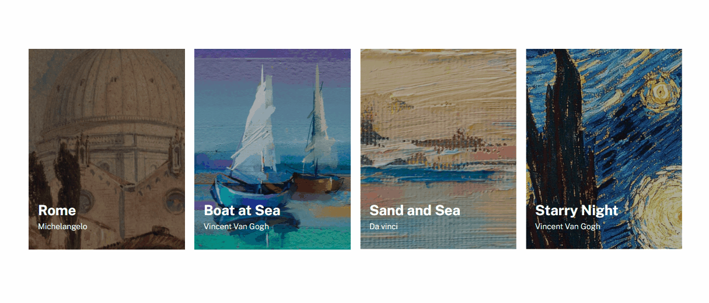

# Exercicio Lista de Imagens Flexbox

Este é um projeto de exercício proposto no curso DevQuest para praticar o uso de CSS Flexbox. O objetivo é replicar um layout pronto (para desktop e mobile) hospedado no Figma.

## Preview



## Tecnologias Utilizadas

- HTML
- CSS (Flexbox)

## Estrutura de Pastas

```
📦 lista-imagens-flexbox
 ┣ 📂 src
 ┃ ┣ 📂 css
 ┃ ┃ ┣ 📜 reset.css
 ┃ ┃ ┣ 📜 style.css
 ┃ ┃ ┗ 📜 responsive.css
 ┃ ┗ 📂 img
 ┃   ┣ 🖼️ rome.png
 ┃   ┣ 🖼️ boat.png
 ┃   ┣ 🖼️ sand-and-sea.png
 ┃   ┗ 🖼️ starry-night.png
 ┣ 📜 index.html
 ┣ 🖼️ lista-de-imagens.gif
 ┗ 📜 README.md
```

## Como Usar

1. Clone este repositório:

```bash
git clone https://github.com/seu_usuario/lista-imagens-flexbox.git
```

2. Navegue até o diretório do projeto:

```bash
cd lista-imagens-flexbox
```

3. Abra o arquivo `index.html` no seu navegador da web.

## Licença

Este projeto está sob a licença MIT. Consulte o arquivo [LICENSE](./LICENSE) para obter mais informações.

---

Desenvolvido por [Alberes](https://github.com/Alberesbass)
